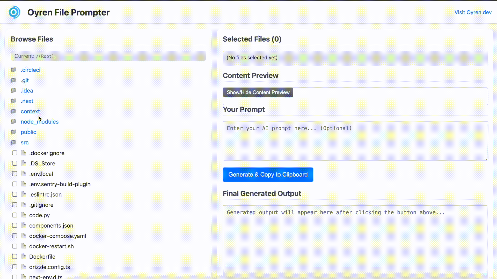

# Oyren Prompter

**Oyren Prompter** is a local web tool that allows you to browse and select multiple files, combine their contents, and prepend a custom prompt. It’s perfect for preparing contextual input for AI chat models — while keeping your files 100% private and on your machine.



---

## 🌐 About [oyren.dev](https://oyren.dev)

> **oyren.dev** is a browser-based AI development platform that helps you build, test, and refine code faster using multiple AI models — no switching between tools, no file uploads. It’s designed for rapid prototyping and real-time code feedback, all in the browser.

**Oyren Prompter** is a companion utility for oyren.dev to help users easily construct prompts from their codebase and use them with AI tools.

---

## Support This Project

If you find Oyren Prompter useful, consider supporting its development!

<a href="https://buymeacoffee.com/vorashil" target="_blank">
  
</a>

Or, use the direct link: [https://buymeacoffee.com/vorashil](https://buymeacoffee.com/vorashil)

---

## 🚀 Getting Started

### Prerequisites

- Docker (for npx/Docker options)
- OR Python 3.7+ with pipx (for Python option)
- Modern web browser

For the recommended npx approach, you'll need Docker:
- Visit https://www.docker.com/get-started
- Download and install Docker Desktop for your OS

For the Python alternative, install `pipx`:
``` 
brew install pipx  # macOS with Homebrew
pipx ensurepath 
pipx --version
```

---

### 🛠 How to Run

#### Option 1: Using npx (Simplest - Recommended)

Run Oyren Prompter with a single command:

```bash
npx oyren-prompter
```

You can also specify a custom port:
```bash
npx oyren-prompter -p 8080
```

**Requirements:** Docker must be installed on your system. If not installed, you'll see instructions on how to get it.

#### Option 2: Using Docker directly

Run Oyren Prompter in a container:

```bash
# Pull and run the latest image
docker run -v $(pwd):/project -p 37465:37465 oyrendev/prompter:latest
```

The `-v $(pwd):/project` flag mounts your current directory into the container, allowing Oyren Prompter to access your files. The container runs on port 37465.

For Windows PowerShell, use:
```powershell
docker run -v ${PWD}:/project -p 37465:37465 oyrendev/prompter:latest
```

#### Option 3: Using pipx (Python alternative)

If you prefer not to use Docker, you can launch Oyren Prompter using pipx:

``` 
pipx run --spec git+https://github.com/oyren-dev/oyren-prompter.git oyren-prompter
```

This will start a local Flask server that scans your files. You can then:

- Select the files you want to use
- Combine them into a single context
- Prepend a custom prompt
- Use the result with your favorite AI tool

✅ All files stay local — nothing is ever uploaded.

---

## 🤝 Contributing

We welcome contributions! Here’s how to get started:

1. **Fork the repository**
2. **Create a feature branch**  
   ```  git checkout -b your-feature-name ``` 
3. **Make your changes**
4. **Commit and push**  
   ```  git commit -m "Describe your change" ```   
   ```  git push origin your-feature-name ``` 
5. **Open a pull request** to the `main` branch

### Contribution Guidelines

- Write clear and concise commit messages
- Document any new features or config changes
- Feel free to open issues for bugs, questions, or suggestions

---

## 📄 License

This project is licensed under the [GNU General Public License v3.0](https://www.gnu.org/licenses/gpl-3.0.en.html).